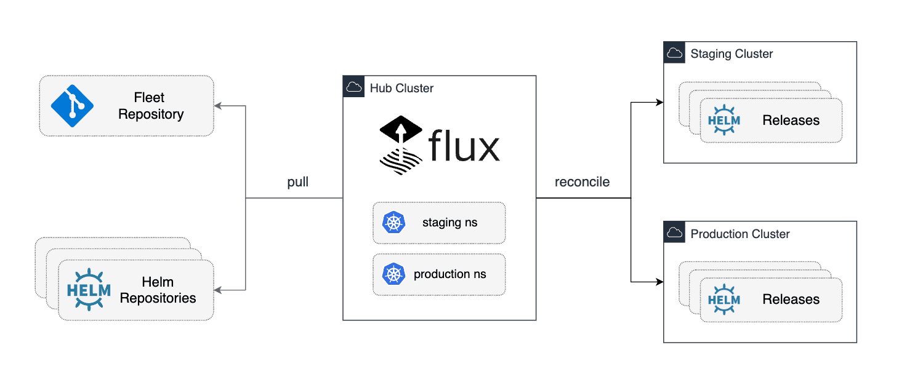

# flux2-hub-spoke-example

[](https://github.com/fluxcd/flux2-hub-spoke-example/actions)
[](https://github.com/fluxcd/flux2-hub-spoke-example/actions)
[](https://github.com/fluxcd/flux2-hub-spoke-example/blob/main/LICENSE)

This repository showcases how to run Flux on a central Kubernetes cluster
and have it manage the GitOps continuous delivery of apps and infrastructure
workloads on multiple clusters.



## Prerequisites

For this example, you need to install the following tools:

- [Flux CLI](https://fluxcd.io/flux/installation/#install-the-flux-cli)
- [Kubernetes KinD](https://kind.sigs.k8s.io/docs/user/quick-start/#installation)
- kubectl and kustomize

On macOS and Linux, you can install the tools using the following commands:

```bash
brew install fluxcd/tap/flux
brew install kind kubectl kustomize
```

In order to follow the guide you'll need a GitHub account and a
[personal access token](https://help.github.com/en/github/authenticating-to-github/creating-a-personal-access-token-for-the-command-line)
that can create repositories (check all permissions under `repo`).

## Repository structure

The Git repository contains the following top directories:

- `deploy` dir contains the HelmRelease definitions for the apps and infrastructure workloads
- `clusters` dir contains the apps and infrastructure Kustomize overlays for each target cluster
- `hub` dir contains the Flux configuration for the central cluster and targets

```shell
├── deploy
│   ├── apps
│   │   ├── podinfo.yaml
│   │   └── kustomization.yaml
│   ├── infra-configs
│   │   ├── cluster-issuers.yaml
│   │   └── kustomization.yaml
│   ├── infra-controllers
│   │   ├── cert-manager.yaml
│   │   ├── ingress-nginx.yaml
│   │   └── kustomization.yaml
│   └── tenants
├── clusters
│   ├── production
│   └── staging
│       ├── apps
│       │   ├── kustomization.yaml
│       │   └── podinfo-values.yaml
│       ├── infra-configs
│       ├── infra-controllers
│       └── tenants
└── hub
    ├── flux-system
    ├── production.yaml
    └── staging.yaml
```

## Bootstrap the cluster fleet

To bootstrap the cluster fleet, first you need to create several Kubernetes KinD
clusters by running the following command:

```shell
make fleet-up
```

The above command will create the following clusters:

- `flux-hub` - the central cluster where Flux will run
- `flux-staging` - the target cluster where Flux will deploy the `clusters/staging` workloads
- `flux-production` - the target cluster where Flux will deploy the `clusters/production` workloads

After the clusters are created, kubeconfig files for staging and production are generated and persisted
in the `flux-hub` cluster, so that Flux can access the target clusters.

```console
$ kubectl get secrets -A
NAMESPACE     NAME                     TYPE
production    cluster-kubeconfig       Opaque
staging       cluster-kubeconfig       Opaque
```

Fork this repository on your personal GitHub account and
export your GitHub access token, username and repo name:

```shell
export GITHUB_TOKEN=<your-token>
export GITHUB_USER=<your-username>
export GITHUB_REPO=<repository-name>
```

Then, bootstrap Flux on the hub cluster:

```shell
flux bootstrap github \
    --context=kind-flux-hub \
    --owner=${GITHUB_USER} \
    --repository=${GITHUB_REPO} \
    --branch=main \
    --personal \
    --path=hub
```

The bootstrap command commits the manifests for the Flux components in `hub/flux-system` dir
and creates a deploy key with read-only access on GitHub, so it can pull changes inside the cluster.

Wait for the Flux to reconcile the infrastructure and apps workloads on the target clusters with:

```shell
watch flux get kustomizations -A
```

Once the Flux Kustomizations are ready, you can list the Helm releases deployed in the target clusters.
For example, in the staging cluster:

```console
$ helm --kube-context kind-flux-staging ls -A
NAME            NAMESPACE       STATUS     CHART
cert-manager    cert-manager    deployed   cert-manager-v1.14.4
ingress-nginx   ingress-nginx   deployed   ingress-nginx-4.10.0 
podinfo         podinfo         deployed   podinfo-6.6.2  
```

For each target cluster, there is a corresponding namespace in the hub cluster that contains the
Flux HelmRelease objects for the apps and infrastructure workloads.
For example, in the staging namespace:

```console
$ flux --context kind-flux-hub -n staging get hr
NAME            REVISION        SUSPENDED       READY                                                                                           
cert-manager    v1.14.4         False           True        
ingress-nginx   4.10.0          False           True      
podinfo         6.6.2           False           True
```

> [!TIP]
> Note that Flux detects changes made directly in-cluster on the objects managed
> by a HelmRelease and automatically [corrects the drift](https://fluxcd.io/flux/components/helm/helmreleases/#drift-detection).
> During an incident or for debugging purposes, you can manually suspend the reconciliation
> of a HelmRelease with `flux suspend hr <name> -n <namespace>`.

## Customize the workloads

Assuming you want to ship workloads to the production cluster with a different configuration,
you can employ Kustomize patches in the `clusters/production` overlay and change the Flux HelmRelease values.

For example, to change the number of replicas for `ingress-nginx` in the production cluster,
you can create a patch file in `clusters/production/infra-controllers/ingress-nginx-values.yaml`:

```yaml
apiVersion: helm.toolkit.fluxcd.io/v2beta2
kind: HelmRelease
metadata:
  name: ingress-nginx
spec:
  chart:
    spec:
      version: ">=4.10.0"
  values:
    controller:
      replicaCount: 2
```

And then apply the patch to the `ingress-nginx` HelmRelease in the
`clusters/production/infra-controllers/kustomization.yaml` file with:

```yaml
apiVersion: kustomize.config.k8s.io/v1beta1
kind: Kustomization
resources:
  - ../../../deploy/infra-controllers
patches:
  - target:
      kind: HelmRelease
      name: ingress-nginx
    path: ingress-nginx-values.yaml
```

Verify that the patch is correctly applied with:

```shell
kustomize build ./clusters/production/infra-controllers/
```

After you commit the changes to the repository, Flux will automatically apply the changes.

You can trigger a manual reconciliation with:

```shell
flux -n production reconcile ks infra-controllers --with-source
```

To verify the number of pods, you can list the deployments in the production cluster:

```console
kubectl --context kind-flux-production -n ingress-nginx get deploy
NAME                       READY   UP-TO-DATE
ingress-nginx-controller   2/2     2
```

> [!IMPORTANT]
> Note that on production clusters, it is recommended to pin the Helm chart to an exact
> version and to use a promotion workflow to test new versions on the staging cluster before
> deploying to production. For more information, see the guide
> [Promote Flux Helm Releases with GitHub Actions](https://fluxcd.io/flux/use-cases/gh-actions-helm-promotion/).

## Security considerations and dependency management

In the `deploy/tenants` dir we provision the tenant namespaces and RBAC resources. There are two types of tenants:

- cluster admins - have full access to the cluster resources and can deploy HelmReleases that contain CRD controllers
- app operators - have restricted access to the app namespaces and can't manage cluster-wide resources like CRDs

At bootstrap, Flux provisions the tenant namespaces and RBAC resources in the target clusters.
The `deploy/apps` HelmReleases are deployed using the `flux-restricted` service account while the
`deploy/infra-controllers` HelmReleases and the `deploy/infra-configs` custom resources
are deployed using the `flux-cluster-admin` service account.

To enforce the RBAC restrictions, and to provision the controllers before the custom resources, we use the
`dependsOn` feature in the `hub/staging.yaml` and `hub/production.yaml` to order the reconciliation like so:

1. `tenants` (namespaces, service accounts and role bindings resources)
2. `infra-controllers` (CRD controllers - depends on `tenants`)
3. `infra-configs` (cluster-wide custom resources - depends on `infra-controllers`)
4. `apps` (app workloads - depends on `infra-configs`)

> [!TIP]
> When managing a large number of tenants and clusters, it is recommended to use run a dedicated
> Flux instance for each group of clusters belonging to the same tenant. For more information
> on how to assign Flux instances to specific clusters, see the
> [Flux sharding and horizontal scaling guide](https://fluxcd.io/flux/installation/configuration/sharding/).

## Cluster connectivity and access control

For the Flux kustomize-controller and helm-controller to be able to
reconcile the remote clusters, the Kubernetes API servers
need to be accessible from the central cluster.

The Flux controllers authenticate with the target clusters using
kubeconfig files stored as Kubernetes secrets in the central cluster.

Both the Flux `Kustomization` and `HelmRelease` objects take a reference to the
Kubernetes secret containing the kubeconfig file:

```yaml
kind: Kustomization | HelmRelease
spec:
  kubeConfig:
    secretRef:
      name: cluster-kubeconfig
```

The secret defined in the `secretRef` must exist in the same namespace as the `Kustomization`
or `HelmRelease` object, and the kubeconfig file must be stored in the `value` data key.

If the target clusters are accessible over a proxy, the proxy address must be set in the kubeconfig file.
If the target API servers use self-signed certificates, both controllers can be configured
to skip the TLS verification by setting the `--insecure-kubeconfig-tls` flag in the controller container args.

> [!IMPORTANT]
> Note that kubeconfigs that rely on exec-based authentication plugins are not supported by default.
> You will need to build custom container images with the necessary binaries and configure
> the controllers with the `--insecure-kubeconfig-exec` flag. Another option is to generate kubeconfigs
> with bearer tokens and refresh them periodically with a CronJob that runs e.g. `aws eks get-token`.

## Monitoring and alerting

To configure Prometheus, Loki and Grafana for monitoring the Flux controllers and the workloads reconciliation,
see the [monitoring example repository](https://github.com/fluxcd/flux2-monitoring-example).

To configure Flux to send events for Slack, Teams, Discord, Sentry and others external system,
you can follow the [alerting guide](https://fluxcd.io/flux/monitoring/alerts/).

## Testing

After making changes to the manifests, you can validate them locally with [kubeconform](https://github.com/yannh/kubeconform) by running:

```shell
make validate
```

Any change to the Kubernetes manifests or to the repository structure should be validated in CI before
a pull requests is merged into the main branch and synced on the cluster.

This repository contains the following GitHub CI workflows:

* the [test workflow](./.github/workflows/test.yaml) validates the Kubernetes manifests and Kustomize overlays are conformant with the Flux OpenAPI spec 
* the [e2e workflow](./.github/workflows/e2e.yaml) starts the Kubernetes cluster fleet in CI and tests the setup by running Flux in Kubernetes Kind

## Teardown

To delete the cluster fleet, run the following command:

```shell
make fleet-down
```
